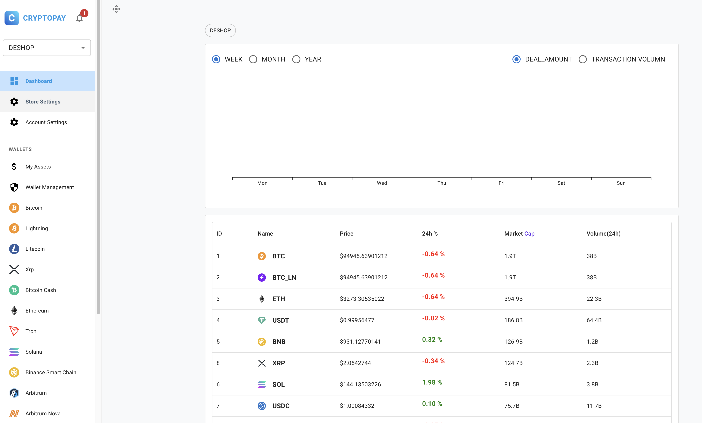

<div align="center">

[](https://cryptopayserver.online/)

# Cryptopayserver

**Open Source Crypto Payment Server**

[**Cryptopayserver.online**](https://cryptopayserver.online) | [**Live Demo**](https://cryptopayserver.online/login) | [**Cryptopayserver Sub**](https://cryptopayserver.online/#pricing) | [**FAQ**](https://cryptopayserver.online/#faq) |
[**Docs**](https://cryptopayserver.gitbook.io/cryptopayserver) | [**Telegram**](https://t.me/cryptopayserver)

[](#)
[](#contributing)
[](./LICENSE)

</div>

**Cryptopayserver** is an open source crypto payment server software built with web technology. The application enables users to receive cryptocurrency payments across multiple blockchains and assets. The software is designed for personal use in continuous operation.

<div align="center">



</div>

## Why Cryptopayserver?

Cryptopayserver is for you if you are...

- 💼 trading and receive cryptocurrencies on multiple blockchains
- 🏦 pursuing a buy & hold strategy
- 🎯 interested in getting insights of your portfolio composition
- 👻 valuing privacy and data ownership
- 🧘 into minimalism
- 😎 self-hosted, zero telemetry
- 👌 open source, forkable

## Features

- **Supported Chains**

    - Bitcoin(Bitcoin Lightning Network)
    - Ethereum
    - Solana
    - Binance Smart Chain
    - Litecoin
    - XRP
    - Ton
    - Tron
    - etc...

- **Dashboard**

    - Track daily order counts, transaction volumes, sales figures, etc.
    - View the current status of the store intuitively.

- **Create Wallet**

    - Create addresses for different chains using a mnemonic phrase, with support for import and export.
    - Default support for major chains and popular cryptocurrencies.
    - Customizable support for additional chains and cryptos.

- **Create Store**

    - Each store has at least one wallet and one mnemonic phrase.
    - Enter basic store information, create a store, and start receiving payments from users.

- **System Notifications**

    - Provides and enables default notification types.
    - Receive in-app system notifications, including version updates, transactions, order completions, etc.

- **Wallet Management**

    - View current wallet balance and manage asset transfers.
    - View balance information for addresses on different chains.
    - View gas fees for sending transactions.
    - View private keys and other sensitive information.

- **Plugin Settings**

    - Support for external e-commerce platform plugin settings.
    - Connect to external service providers.
    - Support for small apps.
    - Plugin services supported: Shopify, Point of Sale, Pay Button, and Crowdfund.

- **Additional Features**

    - Testnet and mainnet switching.
    - Exchange rate services.
    - Currency pair services.
    - Email services.
    - Automation services.
    - Scanner block services.

## Technology Stack

Cryptopayserver is a modern web application written in [TypeScript](https://www.typescriptlang.org).

### Backend

The backend is based on [NextJS](https://nextjs.org) using [MySQL](https://www.mysql.com) as a database together with [Prisma](https://www.prisma.io) and [Redis](https://redis.io) for caching.

### Frontend

The frontend is built with [React](https://react.dev) and uses [MUI](https://mui.com) with utility classes from [Material UI](hhttps://mui.com/material-ui).

<!-- ## Self-hosting

We provide official container images hosted on [Docker Hub](https://hub.docker.com/r/cryptopayserver/cryptopayserver) for `linux/amd64`, `linux/arm/v7` and `linux/arm64`. -->

## Quick Start

### Docker (Recommended)

<!-- ```bash
docker run -d \
  --name cryptopayserver \
  -p 5230:5230 \
  -v ~/.cryptopayserver:/var/opt/cryptopayserver \
  xxxxx/cryptopayserver:stable
``` -->

Open `http://localhost:5230` and start payment!

### Try the Live Demo

Don't want to install yet? Try our [live demo](https://cryptopayserver.online/login) first!

### Other Installation Methods

- **Docker Compose** - Recommended for production deployments
- **Pre-built Binaries** - Available for Linux, macOS, and Windows
- **Build from Source** - For development and customization
<!-- - **Kubernetes** - Helm charts and manifests available -->

See our [installation guide](#) for detailed instructions.

## Contributing

We welcome contributions of all kinds! Whether you're fixing bugs, adding features, improving documentation, or helping with translations — every contribution matters.

**Ways to contribute:**

- 🐛 [Report bugs](https://github.com/cryptopayserver00/cryptopayserver/issues/new?template=bug_report.md)
- 💡 [Suggest features](https://github.com/cryptopayserver00/cryptopayserver/issues/new?template=feature_request.md)
- 🔧 [Submit pull requests](https://github.com/cryptopayserver00/cryptopayserver/pulls)
- 📖 [Improve documentation](https://github.com/cryptopayserver00/cryptopayserver/tree/master/docs)
- 🌍 [Help with translations](https://github.com/cryptopayserver00/cryptopayserver/tree/master/public/locales)

## Sponsors

Love Cryptopayserver? [Sponsor us on GitHub](https://github.com/sponsors/cryptopayserver00) to help keep the project growing!

## Star History

[](https://star-history.com/#cryptopayserver00/cryptopayserver&Date)

## Privacy Policy

Cryptopayserver is built with privacy as a core principle. As a self-hosted application, all your data stays on your infrastructure. There is no telemetry, no tracking, and no data collection. See our [Privacy Policy](https://cryptopayserver.online/privacy) for details.


## License

© 2025 - 2026 [Cryptopayserver](http://cryptopayserver.online)

Cryptopayserver is open-source software licensed under the [MIT License](LICENSE).